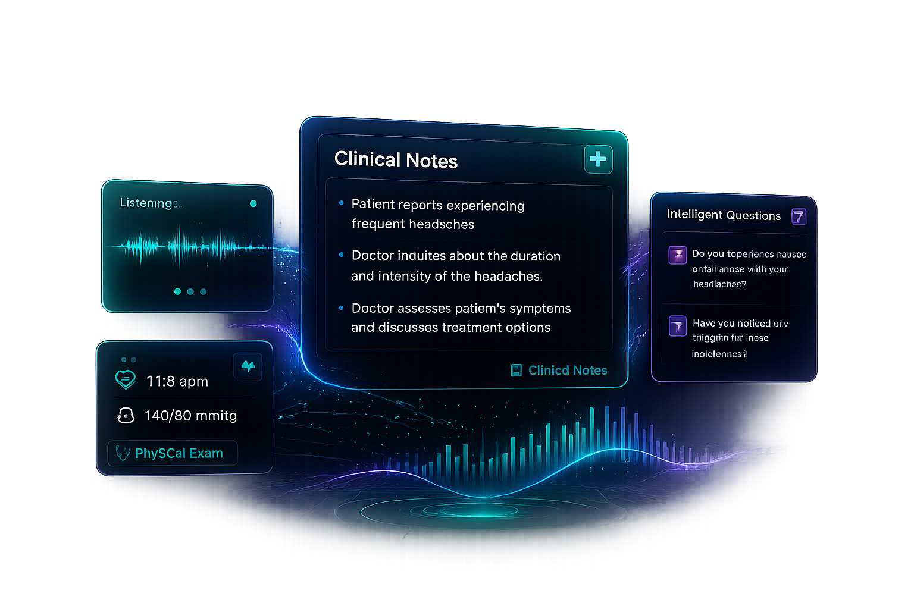

<div align="center">
  

  # MediScribe AI

  **Real-Time AI Clinical Documentation Assistant**

  Transform physician-patient conversations into structured clinical notes with intelligent real-time assistance.

  [](https://opensource.org/licenses/MIT) [](https://www.python.org/downloads/) [](https://reactjs.org/) [](https://fastapi.tiangolo.com/)

  [Features](#-features) • [Demo](#-demo) • [Quick Start](#-quick-start) • [Documentation](#-documentation) • [Tech Stack](#-tech-stack)

</div>

---

## 📖 Overview

**MediScribe AI** is an intelligent clinical documentation assistant that leverages cutting-edge AI to streamline the physician-patient interaction workflow. By capturing and analyzing conversations in real-time, it provides:

- **Live Transcription** - Accurate speech-to-text with medical terminology recognition
- **Intelligent Question Suggestions** - AI-powered diagnostic questions during consultations
- **Clinical Context Extraction** - Automatic identification of symptoms, diagnoses, and medical history
- **Automated Summaries** - Structured clinical notes and conversation overviews

Built for healthcare professionals who want to focus more on patient care and less on documentation.

---

## ✨ Features

### 🎤 Real-Time Audio Capture
Simultaneous capture of both microphone input and system audio for comprehensive conversation recording with multi-channel support.

### 🗣️ Medical-Grade Transcription
Powered by Google's Gemini Live API with low-latency streaming, trained on medical terminology for accurate capture of diagnoses, medications, and clinical observations.

### 🤖 Contextual AI Intelligence
Advanced NLP with **ScispaCy** medical entity recognition automatically extracts:
- Chief complaints
- Symptoms and duration
- Medical history
- Medications and allergies
- Physical examination findings

### 💡 Smart Question Generation
AI analyzes conversation flow to suggest relevant follow-up questions, ensuring comprehensive patient assessment and capturing critical diagnostic information.

### 📝 Automated Documentation
Transform conversations into structured clinical notes with organized SOAP format, ready for EMR integration.

### 🎨 Clean, Medical-Themed Interface
Minimalist design with healthcare-appropriate color palette for distraction-free usage during consultations.

---

## 🎬 Demo

<div align="center">
  
</div>

---

## 🚀 Quick Start

### Prerequisites

Before you begin, ensure you have the following installed:

- **Python 3.10+** - [Download Python](https://www.python.org/downloads/)
- **Node.js 18+** - [Download Node.js](https://nodejs.org/)
- **npm or pnpm** - Package manager
- **Gemini API Key** - [Get your API key](https://aistudio.google.com/apikey)

### Installation

#### 1️⃣ Clone the Repository

```bash
git clone https://github.com/yourusername/clinical-assistant.git
cd clinical-assistant
```

#### 2️⃣ Backend Setup

```bash
# Navigate to backend directory
cd backend

# Create and activate virtual environment
python -m venv venv

# On Windows
.\venv\Scripts\Activate.ps1

# On macOS/Linux
source venv/bin/activate

# Install dependencies
pip install -r requirements.txt

# Download SpaCy models (optional but recommended)
python -m spacy download en_core_web_sm

# For medical NER (better results)
pip install https://s3-us-west-2.amazonaws.com/ai2-s2-scispacy/releases/v0.5.4/en_ner_bc5cdr_md-0.5.4.tar.gz
```

#### 3️⃣ Configure Environment Variables

Create a `.env` file in the `backend` directory:

```env
# Required
GEMINI_API_KEY=your_gemini_api_key_here

# Optional
CORS_ORIGINS=http://localhost:3000,http://localhost:5173
```

#### 4️⃣ Frontend Setup

```bash
# Navigate to frontend directory
cd ../frontend

# Install dependencies
npm install
# or
pnpm install

# Create .env file
cp .env.example .env
```

Edit `frontend/.env`:

```env
VITE_API_BASE_URL=http://localhost:8000
VITE_WS_BASE_URL=ws://localhost:8000
```

#### 5️⃣ Run the Application

**Terminal 1 - Backend:**
```bash
cd backend
python -m uvicorn app.main:app --reload --host 0.0.0.0 --port 8000
```

**Terminal 2 - Frontend:**
```bash
cd frontend
npm run dev
```

**Access the application:**
- Frontend: [http://localhost:5173](http://localhost:5173)
- Backend API: [http://localhost:8000](http://localhost:8000)
- API Documentation: [http://localhost:8000/docs](http://localhost:8000/docs)

---

## 📚 Documentation

### Project Structure

```
clinical-assistant/
├── backend/                  # FastAPI backend
│   ├── app/
│   │   ├── main.py          # Application entry point
│   │   ├── websocket_handler.py  # WebSocket communication
│   │   ├── models/          # Data models and schemas
│   │   ├── services/        # Business logic
│   │   │   ├── llm_service.py      # AI/LLM integration
│   │   │   ├── nlp_service.py      # Medical NER
│   │   │   ├── session_manager.py  # Session handling
│   │   │   └── stt_service.py      # Speech-to-text
│   │   └── utils/           # Utility functions
│   ├── requirements.txt     # Python dependencies
│   └── pyproject.toml       # Project metadata
│
├── frontend/                # React frontend
│   ├── src/
│   │   ├── components/      # Reusable UI components
│   │   ├── hooks/           # Custom React hooks
│   │   ├── pages/           # Page components
│   │   ├── services/        # API & WebSocket clients
│   │   ├── store/           # State management (Zustand)
│   │   └── types/           # TypeScript definitions
│   ├── public/              # Static assets
│   └── package.json         # Node dependencies
│
└── README.md               # This file
```

### API Endpoints

#### HTTP Endpoints

| Method | Endpoint | Description |
|--------|----------|-------------|
| `GET` | `/` | Root endpoint |
| `GET` | `/health` | Health check with API status |
| `POST` | `/sessions/create` | Create new session |
| `GET` | `/sessions/{session_id}` | Get session information |
| `DELETE` | `/sessions/{session_id}` | Delete session |
| `GET` | `/sessions/{session_id}/transcript` | Get session transcript |
| `POST` | `/generate-questions` | Generate diagnostic questions |
| `POST` | `/extract-context` | Extract clinical context |
| `POST` | `/generate-summary` | Generate conversation summary |

#### WebSocket Endpoint

| Endpoint | Description |
|----------|-------------|
| `WS /ws/{session_id}` | Real-time bidirectional communication |

### Usage Guide

1. **Start a Session**
   - Click "Start Session" on the landing page
   - Grant microphone and screen sharing permissions

2. **Capture Conversation**
   - Begin your patient consultation
   - Real-time transcription appears automatically

3. **Get AI Assistance**
   - Click refresh to generate diagnostic questions
   - View extracted clinical context
   - Generate conversation summaries

4. **Export Documentation**
   - Copy transcript for EMR integration
   - Save summaries for clinical notes

---

## 🛠️ Tech Stack

### Backend

- **[FastAPI](https://fastapi.tiangolo.com/)** - Modern, fast web framework for building APIs
- **[Google Gemini API](https://ai.google.dev/)** - Advanced AI for clinical reasoning and transcription
- **[ScispaCy](https://allenai.github.io/scispacy/)** - Medical named entity recognition
- **[WebSocket](https://websockets.readthedocs.io/)** - Real-time bidirectional communication
- **Python 3.10+** - Core programming language

### Frontend

- **[React 19](https://react.dev/)** - UI framework
- **[TypeScript](https://www.typescriptlang.org/)** - Type-safe development
- **[Vite](https://vitejs.dev/)** - Fast build tool
- **[Tailwind CSS](https://tailwindcss.com/)** - Utility-first styling
- **[Zustand](https://zustand-demo.pmnd.rs/)** - Lightweight state management
- **[Axios](https://axios-http.com/)** - HTTP client

### AI & ML

- **Google Gemini Live API** - Low-latency speech-to-text streaming
- **Gemini 2.0 Flash** - Clinical reasoning and question generation
- **Medical NER Models** - Specialized medical entity extraction

---

## 🔒 Privacy & Security

- **Local Processing**: All audio processing happens locally before encryption
- **No Data Storage**: Conversations are stored in memory only during active sessions
- **HTTPS Ready**: Production deployment supports SSL/TLS encryption
- **HIPAA Considerations**: Designed with healthcare compliance in mind (requires additional configuration for production)

> ⚠️ **Note**: This is a proof-of-concept application. For production use in healthcare settings, additional security measures, compliance auditing, and proper data handling procedures must be implemented.

---

## 🤝 Contributing

Contributions are welcome! Please feel free to submit a Pull Request.

1. Fork the repository
2. Create your feature branch (`git checkout -b feature/AmazingFeature`)
3. Commit your changes (`git commit -m 'Add some AmazingFeature'`)
4. Push to the branch (`git push origin feature/AmazingFeature`)
5. Open a Pull Request

---

## 📄 License

This project is licensed under the MIT License - see the [LICENSE](LICENSE) file for details.

---


<div align="center">
  
  **Made with ❤️ for Healthcare Professionals**

  ⭐ Star this repo if you find it helpful!

</div>
